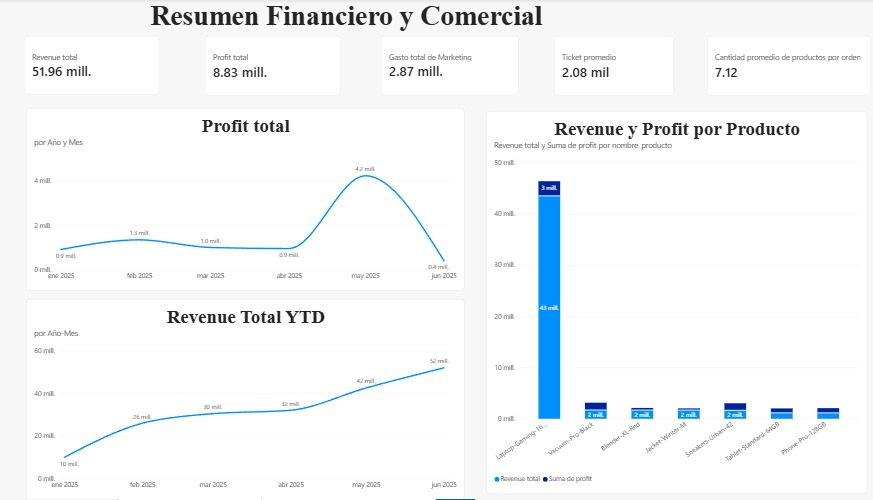
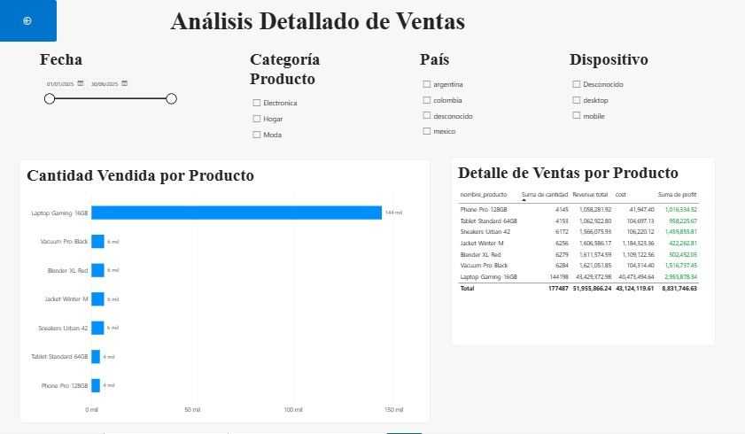

# Rappi Plus – Análisis de Rentabilidad y Desempeño Comercial
Análisis de datos de Rappi Plus durante enero-junio de 2025, enfocado en evaluar ventas, ingresos, costos, rentabilidad y comportamiento de los usuarios mediante Python y Power BI.

## Pregunta de negocio
¿Qué productos, periodos y segmentos presentan el mejor desempeño comercial y dónde existen oportunidades para mejorar la conversión y rentabilidad?

## Objetivo
 - Analizar ingresos, costos y utilidad.
 - Identificar productos y periodos con mejor desempeño.
 - Analizar el embudo de conversión y la retención de usuarios.
 - Evaluar los resultados de una prueba A/B.
 - Crear dashboards para facilitar la interpretación de los resultados.

## Datos
El análisis utiliza información de:
 - Pedidos y ventas.
 - Catálogo de productos.
 - Campañas de marketing.

Periodo: enero-junio de 2025.

## Metodología
 - Limpieza y validación de los datos.
 - Tratamiento de duplicados, valores negativos y datos faltantes.
 - Integración de las tablas y preparación de variables para el análisis.
 - Cálculo de ingresos, costos, utilidad y métricas comerciales.
 - Análisis del embudo de conversión.
 - Análisis de cohortes y retención.
 - Evaluación estadística de una prueba A/B.
 - Construcción de dashboards interactivos en Power BI.

## Herramientas
 - Python
 - Pandas
 - NumPy
 - Power BI

## Dashboards
### Resumen Ejecutivo
Vista general del desempeño comercial mediante indicadores de ingresos, utilidad, ventas y ticket promedio.

### Detalle / Drill-through
Permite profundizar en el desempeño de los productos mediante filtros de fecha, categoría, país y dispositivo.

# Principales hallazgos
 - Laptop-Gaming-16GB destacó por volumen de unidades vendidas y presentó una utilidad aproximada de MX$3.96 millones.
 - Mayo presentó la mayor utilidad del periodo analizado.
 - Junio registró el mayor ingreso, con aproximadamente MX$51.96 millones de ingresos acumulados en el periodo.
 - En el embudo analizado, la conversión entre begin_checkout y add_payment_info fue de 86.71%, con una pérdida de 958 usuarios.
 - La prueba A/B mostró diferencias entre los grupos, pero el resultado no fue estadísticamente significativo (p = 0.4161).

# Archivos del proyecto
 - S12 Estudiante_Proyecto_Final.ipynb — análisis y procesamiento realizado en Python.
 - Proyecto Rappiplus.pbix — archivo del dashboard desarrollado en Power BI.
 - rappi_resumen_ejecutivo.png — captura del dashboard Resumen Ejecutivo.
 - rappi_detalle_drillthrough.png — captura del dashboard Detalle / Drill-through.
